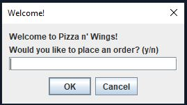

<h1>Java Restaurant Project</h1>

This is a class project I made using the Java programming language in Spring 2023. The program starts in the Order class as a main menu in order to place an order for food in a virtual restaurant. You can order pizza, wings, and dessert with the total of your order being displayed at the end. When the program is terminated, the total amount of orders collected during its lifetime will be displayed for you to see.

## Restaurant.java

  

The project is presented using UI elements provided by the <ins>***javax.swing***</ins> library. The user is presented with a welcome message and is asked to answer "**yes**" or "**no**". If the user enters an input other than the ones listed, the dialog box will continue popping up until the user enters a valid input. Entering yes will allow the user to place an order, entering no will terminate the program.
