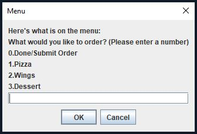

<h1>Java Restaurant Project</h1>

This is a class project I made using the Java programming language in Spring 2023. The program starts in the Order class as a main menu in order to place an order for food in a virtual restaurant. You can order pizza, wings, and dessert with the total of your order being displayed at the end. When the program is terminated, the total amount of orders collected during its lifetime will be displayed for you to see.

## Restaurant.java

  

The project is presented using UI elements provided by the <ins>***javax.swing***</ins> library. The user is presented with a welcome message and is asked to answer "**yes**" or "**no**". If the user enters an input other than the ones listed, the dialog box will continue popping up until the user enters a valid input. Entering yes will allow the user to place an order, entering no will terminate the program.

## Order.java

  

When placing an order, the user is presented a menu of items to choose from. They can add as many items as they want and it will all be counted towards the final order total. There are 3 menu items: Pizza, Wings, Dessert. Every choice is selected by entering a number according to the menu. Once the user is done adding items, they can enter "0" to place the order.

## Pizza.java
<table>
  <tr>
    

      
    

  </tr>
  <tr>
    

      
    

  </tr>
  <tr>
    

      
    

  </tr>
</table>

The first menu item includes all of the pizza options. The user has 3 choices for the size of the pizza, 3 crust choices, and 4 topping choices. When ordering a pizza, the user needs to enter how many they want, and then specify how each pizza will be customized according to their input. After each pizza customization, the description of the pizza will be displayed to the user until all pizza orders have been placed. Once all the pizza orders are finished, the prices are added to the final total.

## Wings.java
<table>
  <tr>
    

      
    

  </tr>
  <tr>
    

      
    

  </tr>
  <tr>
    

      
    

  </tr>
</table>

The second menu item includes all of the wings options. The user has 3 choices for the amount of wings, 2 wing style choices, and 4 sauce choices. When ordering a plate of wings, just like before, the user needs to enter how many they want, and then specify how each plate will be customized according to their input. After each plate customization, the description of the plate will be displayed to the user until all wing orders have been placed. Once all the wing orders are finished, the prices are added to the final total.

## Dessert.java
<table>
  <tr>
    

      
    

  </tr>
  <tr>
    

      
    

  </tr>
</table>

The third menu item includes all of the dessert options. The user has 3 choices for the dessert. This menu is more simplier due to each dessert already stating what it is, so no customization is required. The user only needs to enter a number to signify their choice of dessert. Once all the dessert orders are finished, the prices are added to the final total.

## Ending the Program

  <table>
    <tr>
      <th>
        
      </th>
      <th>
        
      </th>
    </tr>
  </table>

